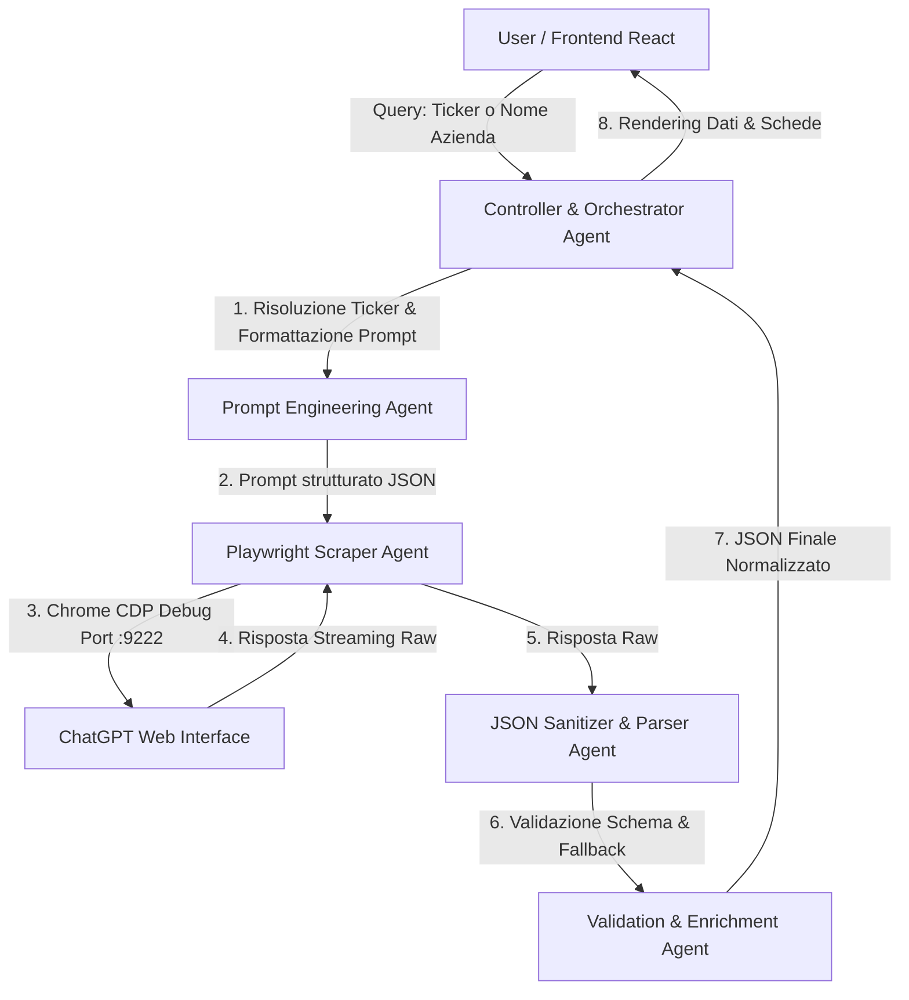

# ⚡ Multi-Agent Financial News Analyzer (Playwright + ChatGPT + React)

Un'applicazione avanzata basata su un'architettura **Multi-Agent** per l'estrazione, la classificazione, l'analisi del sentiment e l'estrazione di dati tecnici di azioni/aziende finanziarie utilizzando **Playwright** per l'automazione su **ChatGPT** e una dashboard moderna in **React**.

---

## 🏛️ Architettura di Sistema (Multi-Agent Architecture)

Il sistema adotta un modello multi-agente per separare nettamente l'orchestrazione delle richieste, l'interazione web con l'LLM, la sintassi e la validazione strutturata dei dati.



### Agenti del Sistema:

1. **Controller & Orchestrator Agent**:
   - Riceve l'input dall'utente (sia esso un Ticker es. `AVIO.MI`, `AAPL`, `VOD.L` oppure un Nome Azienda es. `Avio`, `Apple`, `Vodafone`).
   - Gestisce la sequenza operativa dei singoli moduli e coordina i flussi di fallback.

2. **Prompt Engineering Agent**:
   - Costruisce ed arricchisce i prompt ottimizzati affinché ChatGPT restituisca una risposta deterministica e rigorosamente conforme allo schema **JSON**.

3. **Playwright Scraper Agent**:
   - Gestisce l'interazione diretta con il browser tramite **Chrome Developer Protocol (CDP)** su porta `9222`.
   - Inserisce i dati nel campo di testo di ChatGPT (`prompt-textarea`), invia i messaggi e rileva in tempo reale il completamento della risposta in streaming bypassando blocchi o verifiche interattive.

4. **JSON Sanitizer & Parser Agent**:
   - Estrae ed elide eventuali marcatori di codice markdown (es. ` ```json `), pulisce caratteri di formattazione non validi e valida la sintassi del JSON generato dall'LLM.

5. **Validation & Enrichment Agent**:
   - Garantisce la presenza dei tre livelli di profondità temporale (*News degli ultimi 3 giorni*, *Ultime notizie storiche rilevanti disponibili*, *Supporti/Resistenze e Target Price*).

---

## 📐 Schema dell'Output JSON Generato

Ogni analisi produce un oggetto JSON rigoroso con la seguente struttura:

```json
{
  "search_metadata": {
    "query_input": "AVIO.MI",
    "company_name": "Avio S.p.A.",
    "ticker": "AVIO.MI",
    "market": "Borsa Italiana",
    "timestamp_utc": "2026-08-04T21:00:00Z"
  },
  "market_sentiment_summary": {
    "overall_sentiment": "Positivo",
    "sentiment_score": 0.8,
    "expected_impact": "Rialzista di breve termine",
    "summary_explanation": "Sintesi breve sui driver principali che influenzano il titolo."
  },
  "recent_news_last_3_days": [
    {
      "id": "news_1",
      "headline": "Titolo notizia recente negli ultimi 3 giorni (compreso oggi)",
      "date": "2026-08-04",
      "source": "Il Sole 24 Ore / Yahoo Finance",
      "category": "Financials / Contratto",
      "summary": "Riassunto dettagliato...",
      "sentiment": "Positivo",
      "impact_rating": "Alto",
      "source_url": "https://..."
    }
  ],
  "latest_available_news": [
    {
      "id": "news_2",
      "headline": "Ultima notizia storica rilevante (se assenti novità nei 3 giorni)",
      "date": "2026-07-20",
      "source": "Milano Finanza",
      "category": "M&A / Partnership",
      "summary": "Riassunto dell'ultima notizia nota...",
      "sentiment": "Positivo",
      "impact_rating": "Medio",
      "source_url": "https://..."
    }
  ],
  "analyst_ratings_and_targets": [
    {
      "broker": "Equita SIM",
      "rating": "Hold",
      "target_price": 32.5,
      "currency": "EUR",
      "date": "2026-06-01"
    }
  ],
  "technical_levels": {
    "supports": ["€29.50", "€28.60"],
    "resistances": ["€31.70", "€33.00"],
    "critical_levels_notes": "Note sui livelli chiave e spartiacque di trend."
  }
}
```

---

## 🛠️ Struttura del Repository

```text
chatgpt/
├── chatgpt_playwright_demo.py   # Agent Python Playwright (collegamento via CDP su porta 9222)
├── requirements.txt             # Dipendenze Python (playwright, telepot, pandas, requests)
├── .env.example                 # File di esempio per credenziali e chiavi ambiente
├── README.md                    # Documentazione di sistema e architettura
└── frontend/                    # Application Dashboard React (Vite + React)
    ├── src/
    │   ├── App.jsx              # Dashboard UI in React (Badge sentiment, schede news, JSON viewer)
    │   ├── index.css            # Design system e stili Dark Mode
    │   └── main.jsx
    ├── package.json
    └── vite.config.js
```

---

## 🚀 Guida all'Installazione ed Esecuzione

### 1. Requisiti di Sistema
- **Python 3.8+**
- **Node.js 18+**
- **Google Chrome**

### 2. Installazione Dipendenze Python

```bash
pip install -r requirements.txt
python -m playwright install chromium
```

### 3. Avvio di Chrome con porta CDP Debug (:9222)

Apri il prompt dei comandi (CMD) ed esegui:

```cmd
"C:\Program Files\Google\Chrome\Application\chrome.exe" --remote-debugging-port=9222 --user-data-dir="%TEMP%\chatgpt-cdp-profile" https://chatgpt.com/
```
*(Effettua il login a ChatGPT nella finestra browser aperta se necessario)*.

### 4. Esecuzione Agent Python (Playwright Test)

```bash
python chatgpt_playwright_demo.py --stocks AVIO.MI --no-telegram
```

### 5. Avvio della Dashboard React

In una nuova finestra di terminale:

```bash
cd frontend
npm install
npm run dev
```

Apri `http://localhost:5173/` per utilizzare l'interfaccia di prova.
