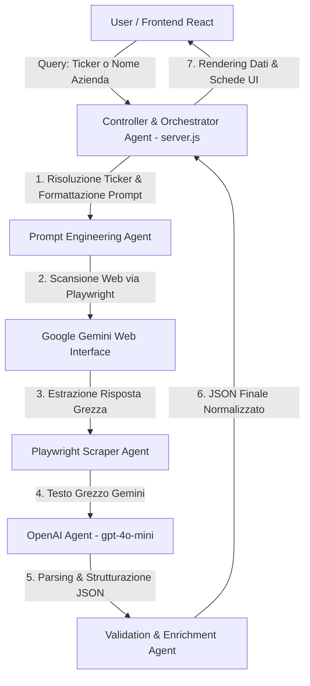

# ⚡ Multi-Agent Financial News & Vision Analyzer (Gemini Web + OpenAI Agent)

Un'applicazione avanzata basata su un'architettura **Multi-Agent** per l'estrazione, la classificazione, l'analisi del sentiment e l'estrazione di dati tecnici di azioni/aziende finanziarie.

---

## 🌿 Struttura Branch Git e Tecnologie per Modello

- **Branch `gemini`** (Branch Attuale):
  - **Scraper Web**: **Playwright** interagisce direttamente con **Google Gemini Web (`https://gemini.google.com/app`)** tramite browser Chrome.
  - **AI Agent Parsing**: Utilizza l'**API di OpenAI (`gpt-4o-mini`)** per convertire la risposta grezza estrazione da Gemini Web in un JSON strutturato e rigoroso.
  - **Script Principale**: `gemini_playwright_demo.py`
  - **Funzionalità di Aggiornamento Flessibile**: Possibilità di aggiornare **Notizie & Sentiment (📰)**, **Analisi Grafico AI (📊)** oppure **Entrambi (⚡)**.

- **Branch `feature/next-updates`**:
  - **Scraper Web**: **Playwright** interagisce direttamente con **ChatGPT Web (`https://chatgpt.com/`)**.
  - **Script Principale**: `chatgpt_playwright_demo.py`

---

## 🏛️ Architettura di Sistema (Branch Gemini)

Il sistema adotta un modello multi-agente per separare nettamente l'orchestrazione delle richieste, l'interazione web con l'LLM, la sintassi e la validazione strutturata dei dati.



### Agenti del Sistema:

1. **Controller & Orchestrator Agent (`server.js`)**:
   - Riceve l'input dall'utente dal Frontend React e coordina i moduli di ricerca Notizie e Analisi Grafico AI.
   - Permette l'aggiornamento selettivo: **Solo Notizie (📰)**, **Solo Grafico (📊)** o **Entrambi (⚡)**.

2. **Playwright Scraper Agent (`gemini_playwright_demo.py`)**:
   - Gestisce l'interazione con **Google Gemini Web (`https://gemini.google.com/app`)**.
   - Rimuove automaticamente banner di consenso Cookie/Privacy (`dismiss_overlay_modals`) per evitare timeout di click e garantisce l'avvio in modalità visibile su Chrome.

3. **OpenAI Agent Parser (`gpt-4o-mini`)**:
   - Riceve il testo grezzo da Gemini Web e lo converte in un blocco **JSON** rigoroso e conforme allo schema dell'applicazione.

4. **Validation & Enrichment Agent**:
   - Sanitizza ed elide eventuali livelli anomali (spike > 5000), garantendo la separazione **100% pura** tra le Notizie e l'Analisi Visiva del Grafico.

---

## 📐 Schema dell'Output JSON Generato

Ogni analisi produce un oggetto JSON rigoroso con la seguente struttura:

```json
{
  "search_metadata": {
    "query_input": "NVDA",
    "company_name": "NVIDIA Corporation",
    "ticker": "NVDA",
    "market": "NASDAQ",
    "analysis_type": "NEWS_RESEARCH",
    "timestamp_utc": "2026-08-09T19:25:00Z"
  },
  "market_sentiment_summary": {
    "overall_sentiment": "Molto Positiva",
    "sentiment_score": 0.91,
    "expected_impact": "Impatto atteso positivo sul titolo, con momentum favorevole.",
    "summary_explanation": "Sintesi breve sui driver principali che influenzano il titolo."
  },
  "recent_news_last_3_days": [
    {
      "id": "news_1",
      "headline": "Titolo notizia recente negli ultimi 3 giorni",
      "date": "2026-08-08",
      "source": "Reuters / Yahoo Finance",
      "category": "Financials",
      "summary": "Riassunto dettagliato...",
      "sentiment": "Positivo",
      "impact_rating": "Alto",
      "source_url": "https://..."
    }
  ],
  "chart_vision_analysis": {
    "trend_direction": "Rialzista",
    "chart_pattern": "Doppio Minimo di inversione",
    "breakout_trigger": "224.76 €",
    "structural_support": "189.80 €",
    "secondary_support": "190.01 €",
    "structural_resistance": "224.76 €",
    "vision_summary_explanation": "Descrizione approfondita della price action, dell'inclinazione dell'Alligator e degli oscillatori.",
    "operational_note": "Nota operativa prudente e dettagliata per la gestione della posizione."
  }
}
```

---

## 🛠️ Struttura del Repository

```text
chatgpt/
├── gemini_playwright_demo.py    # Agent Python Gemini Web + OpenAI Parsing Agent (Branch gemini)
├── chatgpt_playwright_demo.py   # Agent Python ChatGPT Web (Branch feature/next-updates)
├── server.js                    # Backend Node.js Orchestrator & API Server (porta 3001)
├── requirements.txt             # Dipendenze Python (playwright, pandas, requests)
├── README.md                    # Documentazione di sistema e architettura
└── frontend/                    # Dashboard UI React (Vite + React)
    ├── src/
    │   ├── App.jsx              # Dashboard UI in React (Aggiornamenti Flessibili, Vision AI, Interactive Charts)
    │   ├── index.css            # Design system e stili Dark Mode
    │   └── main.jsx
    ├── package.json
    └── vite.config.js
```

---

## 🚀 Guida all'Installazione ed Esecuzione

### 1. Requisiti di Sistema
- **Python 3.8+**
- **Node.js 18+**
- **Google Chrome**
- **Chiave API OpenAI** (Configurata in `.env` come `OPENAI_API_KEY=sk-...`)

### 2. Installazione Dipendenze Python e Node

```bash
pip install -r requirements.txt
python -m playwright install chromium

cd frontend
npm install
```

### 3. Avvio Server Backend e Dashboard

In un terminale:
```bash
node server.js
```

In un secondo terminale:
```bash
cd frontend
npm run dev
```

Apri `http://localhost:5173/` per utilizzare l'applicazione. Potrai scegliere se aggiornare **Notizie (📰)**, **Grafico (📊)** oppure **Entrambi (⚡)**!
