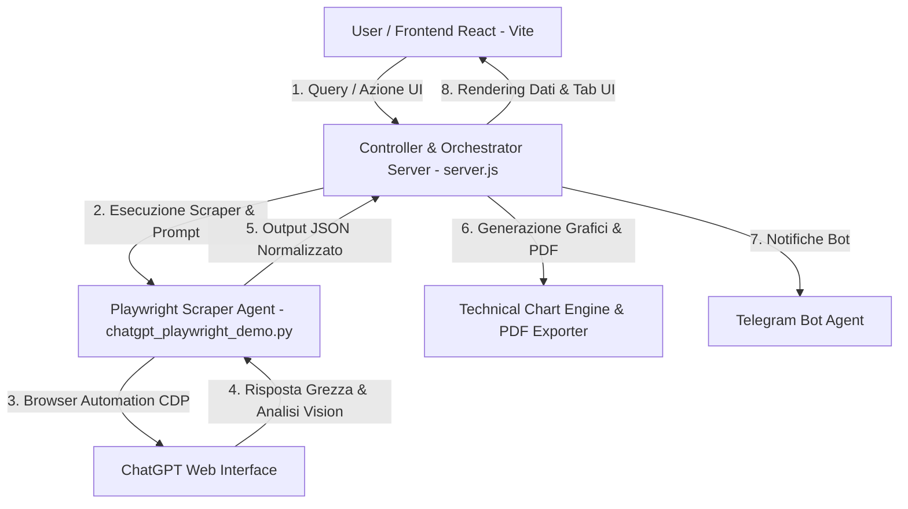

# ⚡ Multi-Agent Financial News, Vision & Portfolio Analyzer (ChatGPT Web)

Un'applicazione avanzata ed evoluta basata su un'architettura **Multi-Agent** per l'estrazione notizie, l'analisi del sentiment, la generazione di grafici e indicatori tecnici, l'analisi operativa delle azioni, lo scouting automatico sul FTSE MIB, la gestione del portafoglio e l'esportazione di report PDF.

L'intero sistema su questo branch è totalmente integrato con **ChatGPT Web (`https://chatgpt.com/`)**.

---

## 🌿 Tecnologie & Architettura Web Agent

- **Scraper Web & Agent Primario**: **Playwright** interagisce direttamente con **ChatGPT Web (`https://chatgpt.com/`)** tramite browser Chrome (supporto profilo dedicato e modalità CDP remote debugging sulla porta 9222).
- **Script Principale**: [`chatgpt_playwright_demo.py`](file:///c:/Users/theoi/PycharmProjects/webscraping/chatgpt_playwright_demo.py)
- **Funzionalità Chiave**: Analisi flessibile Notizie & Grafico AI, Scouting automatico notizie ed esecuzione batch strategie grafiche su FTSE MIB, integrazione Bot Telegram, Generatore di Report PDF e Gestore del Portafoglio.

---

## 🏛️ Architettura di Sistema

Il sistema adotta un modello multi-agente per separare nettamente l'orchestrazione delle richieste, l'interazione web con ChatGPT Web, la sintassi tecnica dei grafici, l'invio delle notifiche e l'esportazione dei report.



### Agenti e Moduli Principali:

1. **Controller & Orchestrator Agent (`server.js`)**:
   - Server Node.js che coordina le API REST e lo streaming SSE dei log verso il Frontend React.
   - Gestisce la persistenza delle watchlist, le quotazioni in tempo reale, i task di automazione FTSE MIB e l'esportazione dei PDF.

2. **Playwright Scraper Agent (`chatgpt_playwright_demo.py`)**:
   - Gestisce l'interazione diretta con **ChatGPT Web (`https://chatgpt.com/`)**.
   - Supporta sia l'avvio autonomo di Chrome sia la connessione via CDP (`http://127.0.0.1:9222`) a una sessione browser Chrome già aperta con login utente salvato.
   - Esegue analisi di notizie, analisi visive dei grafici (`--analyze-chart`) e batch automatici per il FTSE MIB.

3. **Export Report PDF Agent (`export_analysis_pdf.py`)**:
   - Engine basato su **ReportLab** per la generazione di report PDF strutturati e professionali.
   - Produce schede analitiche per singolo titolo e report completi per l'intero portafoglio, includendo tabelle di prezzo, indicatori grafici e piani operativi.

4. **Technical Chart & Indicator Engine (`stock_chart_ai_analysis.py` / `finance_charts`)**:
   - Calcola e genera grafici ad alta risoluzione con indicatori di analisi tecnica: Candlestick, Alligator, CPR, MI, Volumi, MACD, RSI e ADX.
   - Identifica ed elida automaticamente i livelli chiave (supporti, resistenze, trigger di breakout).

5. **Agent Portfolio Manager (`agent_portfolio_manager.py` / `finance_tools`)**:
   - Agente basato su **OpenAI Agents** per la scansione dei titoli del MIB30, la proposta di riallocazioni e il monitoraggio delle posizioni del portafoglio virtuale.

6. **Telegram Bot Agent (`telepot` & API Telegram)**:
   - Modulo di notifica automatica per l'invio immediato di schede grafiche, report di analisi e strategie sui titoli al canale/chat Telegram dell'utente.

---

## 🖥️ Interfaccia Utente (Frontend React / Vite)

La Dashboard React offre un'esperienza suddivisa in **4 sezioni principali**:

1. 💼 **Portafoglio & Trading Watchlist**: Monitoraggio delle posizioni aperte, valore totale, profitto/perdita, quotazioni aggiornate e tab con grafici tecnici interattivi e piano operativo (candele, linee e livelli).
2. 📊 **Dashboard / Analisi**: Tabella watchlist interattiva con schede di analisi dettagliate, filtri ticker, download dei report PDF e pulsanti di aggiornamento selettivo: **Solo Notizie (📰)**, **Solo Grafico (📊)** oppure **Entrambi (⚡)**.
3. ⚡ **Automazione FTSE MIB**: News Scouting automatico sui principali titoli del FTSE MIB, esecuzione batch di strategie grafiche e controllo rapido dell'avvio del browser Chrome con profilo ChatGPT.
4. 📑 **Terminal / Log di Esecuzione**: Log in streaming continuo per monitorare in tempo reale l'avanzamento degli agenti Python e dei processi di background.

---

## 📐 Schema dell'Output JSON Generato

Ogni analisi produce un oggetto JSON rigoroso con la seguente struttura:

```json
{
  "search_metadata": {
    "query_input": "NVDA",
    "company_name": "NVIDIA Corporation",
    "ticker": "NVDA",
    "market": "NASDAQ",
    "analysis_type": "FULL_ANALYSIS",
    "timestamp_utc": "2026-08-09T19:25:00Z"
  },
  "market_sentiment_summary": {
    "overall_sentiment": "Molto Positiva",
    "sentiment_score": 0.91,
    "expected_impact": "Impatto atteso positivo sul titolo, con momentum favorevole.",
    "summary_explanation": "Sintesi breve sui driver principali che influenzano il titolo."
  },
  "recent_news_last_3_days": [
    {
      "id": "news_1",
      "headline": "Titolo notizia recente negli ultimi 3 giorni",
      "date": "2026-08-08",
      "source": "Reuters / Yahoo Finance",
      "category": "Financials",
      "summary": "Riassunto dettagliato...",
      "sentiment": "Positivo",
      "impact_rating": "Alto",
      "source_url": "https://..."
    }
  ],
  "chart_vision_analysis": {
    "trend_direction": "Rialzista",
    "chart_pattern": "Doppio Minimo di inversione",
    "breakout_trigger": "224.76 €",
    "structural_support": "189.80 €",
    "secondary_support": "190.01 €",
    "structural_resistance": "224.76 €",
    "vision_summary_explanation": "Descrizione approfondita della price action, dell'inclinazione dell'Alligator e degli oscillatori.",
    "operational_note": "Nota operativa prudente e dettagliata per la gestione della posizione."
  }
}
```

---

## 🛠️ Struttura del Repository

```text
chatgpt/
├── chatgpt_playwright_demo.py   # Agent Python ChatGPT Web & Automazione Playwright
├── server.js                    # Backend Node.js Orchestrator & API Server (porta 3001)
├── export_analysis_pdf.py       # Engine di generazione e formattazione dei Report PDF (ReportLab)
├── stock_chart_ai_analysis.py   # Engine per calcolo indicatori tecnici e rendering grafici
├── agent_portfolio_manager.py  # Agente gestore del portafoglio e scanner MIB30 (OpenAI Agents)
├── finance_charts/              # Moduli di generazione e rendering dei grafici finanziari
├── finance_tools/               # Moduli e utilities per portafoglio, notizie e scanner MIB30
├── portfolio.json               # File di stato e storico del portafoglio monitorato
├── portfolio.example.json       # Template di esempio per la struttura del portafoglio
├── start_app.bat                # Script batch per avviare ambiente Conda, Backend Node e Frontend React
├── open_chrome_for_chatgpt.bat  # Script batch per avviare Chrome con porta di debug CDP (9222)
├── requirements.txt             # Dipendenze Python complete del progetto
├── README.md                    # Documentazione di sistema e architettura
└── frontend/                    # Dashboard UI React (Vite + React)
    ├── src/
    │   ├── App.jsx              # Application Dashboard UI React
    │   ├── index.css            # Design system e stili Dark Mode
    │   └── main.jsx
    ├── package.json
    └── vite.config.js
```

---

## 🚀 Guida all'Installazione ed Esecuzione

### 1. Requisiti di Sistema
- **Python 3.8+**
- **Node.js 18+**
- **Google Chrome**
- **Chiave API OpenAI** e **Token Telegram** (Configurati nel file `.env`)

### 2. Configurazione `.env`
Crea un file `.env` nella radice del progetto:

```env
OPENAI_API_KEY=sk-...
TELEGRAM_BOT_TOKEN=123456789:ABC...
TELEGRAM_RECEIVER_ID=123456789
```

### 3. Installazione Dipendenze Python e Node

```bash
pip install -r requirements.txt
python -m playwright install chromium

cd frontend
npm install
```

### 4. Avvio Rapido (Consigliato)

Esegui semplicemente lo script batch **`start_app.bat`** (oppure fai doppio clic su di esso):

```cmd
start_app.bat
```

Questo avviarià automaticamente l'ambiente Conda (`openaiAgent`) e aprirà due finestre PowerShell dedicate per il **Backend Node.js** (`http://localhost:3001`) e il **Frontend React** (`http://localhost:5173`).

---

### 5. Avvio Manuale (Alternativo)

In un primo terminale (Backend Node.js):
```bash
node server.js
```

In un secondo terminale (Frontend React):
```bash
cd frontend
npm run dev
```

Apri `http://localhost:5173/` nel browser per accedere alla dashboard completa!

